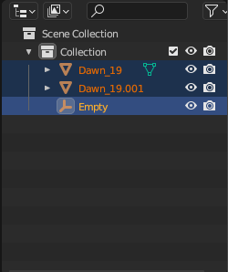

# Object Seperation Walkthrough

[Overview](#overview)

[Import Object](#importObject)

[Modeling and Selection](#modeling)

[Object Parenting](#objectparenting)

<h1 id='overview'> Overview </h1>
This is step by step walkthrough on how to achieve object seperation for use in segmentation. This is done in the event that object file has all the pieces as a whole object instead of having the sections seperated.

 
*Note: this was done on Mac, but should be similar if done on other OS.

---
<h3 id='importObject'> Import Object </h3>

Open up you blender application and pick general file. You should see the default layout as shown below

Clear all the current object as they might intefere with the next steps.

Go under file and import the object. Up till now I've only experimented with .obj and .stl files however, you are free to choose as long as the object points

  

For this, I used the Dawn model as an example.

Models are found here: https://nasa3d.arc.nasa.gov/models/printable

<h3 id='modeling'> Modeling and Selection</h3>

Once object is imported, go to modeling and select wireframe.

You can select the points and sections you want to seperate into different objects. By using the mouse to drag a select box, use the 'Lasso select' or mannually selecting the points.

*Note: You can use shift key + mouse to add on to what has already been selected. You need to play around with the different angles and zoom to be precise.

<h6>Mouse Select dragging<h6>

<h6>Lasso Select Option<h6>

After Selecting the desired section to seperate, click mesh and go to seperate, then click selection. <b>You can also press P for shorcut.</b>

https://docs.blender.org/manual/en/latest/modeling/meshes/editing/mesh/separate.html

Once seperated, another object should appear under the collection or scene. Change the mode back to <b> object mode </b> instead of edit mode to view the changes.

  
   

<!-- 

  
   

 -->

<b>Save the file as .obj and it is ready to be used for data generation!</b>

<h3 id='objectparenting'>Object Parenting</h3>

<b> This part can be safely ignored since the initial constructor in the code does the parenting, however this part shows how to do it manually. Do not add empty plain axis when using the generator code, as it assumes the imported object file has all the objects seperated and will assign an empty plain axis as a parent</b>

After we've done the seperation, we need to do the parenting to ensure that the seperated objects move together. To do this we're going to add an empty plain axis.

Select the objects with the empty axis as the active object. When parenting is set, the active object will be the parent of all selected. To do this, use the ctlr key and select (ctrl key + left click) all of the objects with the empty axis being the last one. This is because the last object to be selected is the empty object. To know which is current the active object, it is has a lighter yellow highlight on the name compared to the orange highlight on the other objects

  

Click the parenting option under Object -> parent -> object.

Pretty good video describing object parenting:

- https://www.youtube.com/watch?v=GS452KMVWKA

Official documentation on parenting:

- https://docs.blender.org/manual/en/latest/scene_layout/object/editing/parent.html