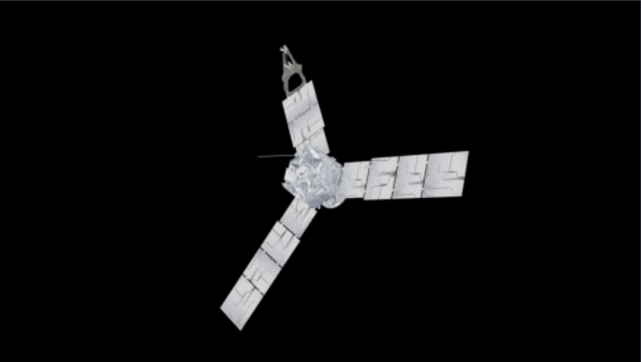
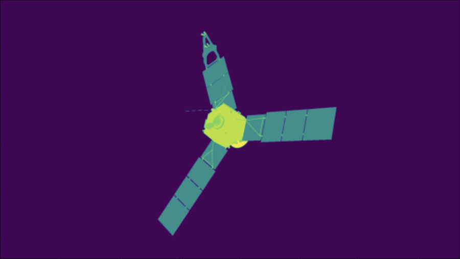

# 3DPoseEstimation
[Overview](#overview)

[Getting Started](#gettingstarted)

[Data Preview](#datapreview)

[References](#references)

[Blender Object Segmentation](/ObjectSegmentationWalkthrough.md)

<h2 id='overview'> Overview </h2>

---
This repository contains Python code to interface with blender to generate synthetic data. These data are images that include annotation of segmentation and object quaternion. Random rotation and camera distances are currently used for data generation, other variations may be included later for future addition.

<h2 id='gettingstarted'> Getting Started </h2>

---
Before getting started, install the blender python module, mathutils and numpy.

https://wiki.blender.org/w/index.php?title=Building_Blender/Other/BlenderAsPyModule

You can use a conda environment instead this which is personally recommended as you can attempt installation just using pip install bpy.

https://pypi.org/project/mathutils/

```
 pip install mathutils
 pip install numpy
```

Run python in the terminal/console.
Make sure you are using Python version is >= 3.x

```
$python
```

Run the folowing code to make sure it runs with no error.

```python
>>> import numpy
>>> import mathutils
>>> import bpy
```
Clone this repository into your desired folder and 
attempt your first script.

```python
from BlenderDataGenerator import SatteliteData

generator = SatteliteData.Generator()

```
<h2 id='datapreview'> Data Preview </h2>

---
The data generated from this script contains annotation and images in png format which can be changed to other formats within the script if needed. The JSON annotation file contains all metadata for the images and the associated segmentation file.

Metadata:

<b>image_file</b>: is the filename on the data itself.


<b>segmentation_file</b>: is the npy file which contains the array data for the segmentation which has a default shape of (1080, 1920). The segmentation is numbered based on how many objects is seperated on the object.

<b>quaternion</b>: contains the four variables (w,x,y,z) for the quaternions which represents the rotation about the object's axis at which the camera is viewing.


<div align="center">
<h3><b> JSON annotation example </b></h3>
<div align="left">

```json
{
    "images": [
        {
            "id": 0,
            "image_file": "image0.png",
            "segmentation_file": "segmentation0.npy",
            "quaternion": [
                -0.1703329235315323,
                0.06445111334323883,
                -0.8884263038635254,
                0.42687997221946716
            ]
        },
        {
            "id": 1,
            "image_file": "image1.png",
            "segmentation_file": "segmentation1.npy",
            "quaternion": [
                0.33882102370262146,
                -0.3533002734184265,
                0.24369029700756073,
                -0.5794264078140259
            ]
        },
        {
            "id": 2,
            "image_file": "image2.png",
            "segmentation_file": "segmentation2.npy",
            "quaternion": [
                0.19276432693004608,
                0.09966883063316345,
                -0.7412636280059814,
                -0.19215363264083862
            ]
        }, 
    ...
    ]
}
```
</div>
<h3><b>Image preview</b><h3>



<h3><b>Segmentation preview</b><h3>



</div>

<h2 id='references'> References </h2>

----
```python
class Generator():
    def __init__(self, filePath = None, objectFile = None)
```
Generator constructor function, sets up the environment, camera and objects axis.

If <b>objectFile</b> is given then generator will import object file from the given path.

Data and annotation file path is used in the <b>filePath</b> variable, if no file path has been given then it will use the current directory in which the generator is created.

Parameters:

<table>
<tr>
<td>
<code>objectFile<code>
</td>
<td>
Path of object file to import. Currently only wavefront obj is supported.
</td>
</tr>
</table>
```objectFile``` :

```filePath``` :
Class variables:

<b>```self.scene```</b>

<b>```self.ObjectAxis>```</b>

<b>```self.CameraAxis>```</b>

<b>```self.Camera>```</b>

<b>```self.cameraDistance>```</b>

<b>```self.lighting>```</b>

<b>```self.rng>```</b> 

<b>```self.filePath>```</b>

<b>```self.dataFilePath```</b>

<b>```self.annotationFilePath>```</b>

<b>```self.tempFilePath>```</b>

<b>```self.objects>```</b>


```python
def randomQuaternion(self):
```
```python
def getResolution(self):
```
```python
def cleanFolder(self, folderPath):
```
```python
def loadData(self, filePath, type=None):
```

```python
def findCameraDistance(self, cameraArg, objectArg):
```
```python
def generateData(self, amount = 0):
```
```python
def getBoundingBox(self, object):
```
```python
def setSegmentationNodes(self):
```
```python
def getSegmentation(self):
```
```python
def formatCoordinates(self, id, coordinates):
```
```python
def getBoundingBoxCoordinates(self):
```
