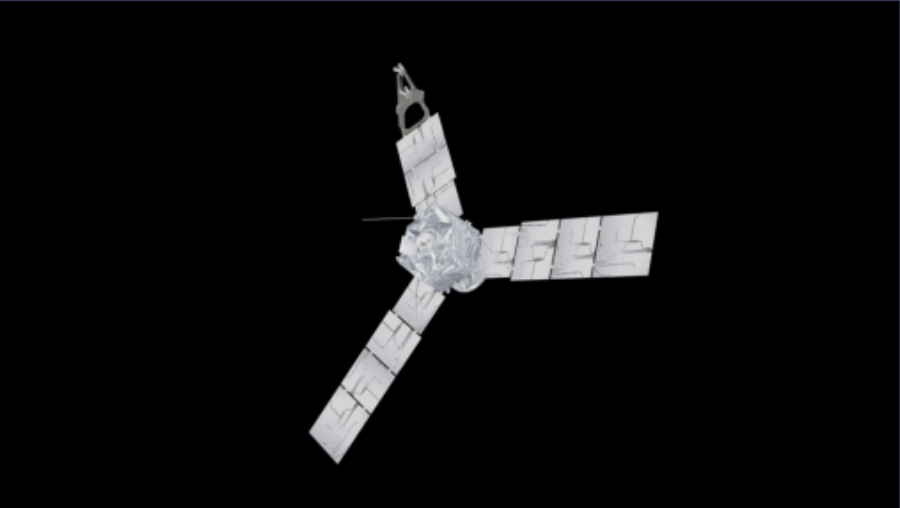
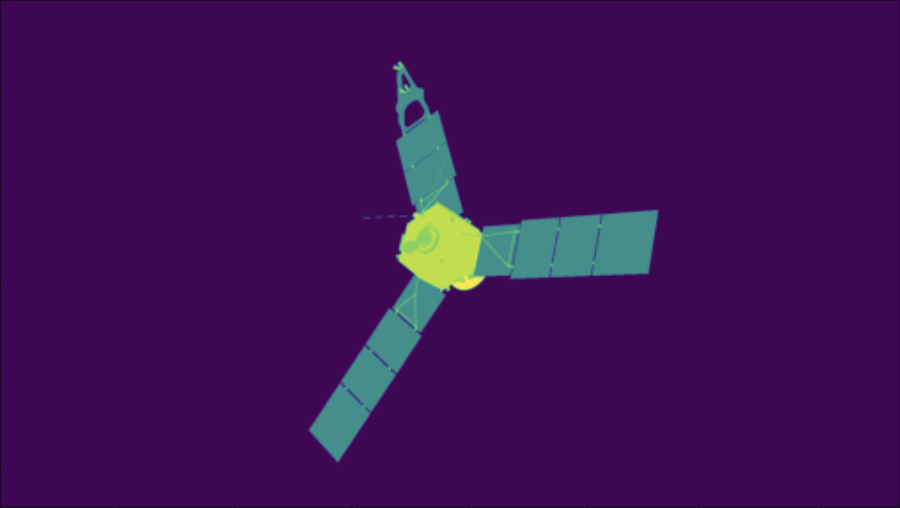

# 3DPoseEstimation
[Overview](#overview)

[Getting Started](#gettingstarted)

[Data Preview](#datapreview)

[Class Method References](#references)
- [SatteliteData.Generator(filePath = None, objectFilePath = None](#SatteliteData.Generator)
- [importObject(objectFilePath)](#importObject)
- [randomQuaternion()](#randomQuaternion)
- [getResolution()](#getResolution)
- [cleanFolder(folderPath)](#cleanFolder)
- [loadData(filePath)](#loadData)
- [findCameraDistance(cameraArg, objectArg)](#findCameraDistance)
- [generateData(amount=0)](#generateData)
- [getBoundingBox(object)](#getBoundingBox)
- [setSegmentationNodes()](#setSegmentationNodes)
- [getSegmentation()](#getSegmentation)
- [formatCoordinates(coordinates)](#formatCoordinates)
- [getBoundingBoxCoordinates()](#getBoundingBoxCoordinates)

[Blender Object Seperation](/ObjectSeperationWalkthrough.md)


<h1 id='overview'> Overview </h1>

This repository contains Python code to interface with blender to generate synthetic data. These data are images that include annotation of segmentation and object quaternion. Random rotation and camera distances are currently used for data generation, other variations may be included later for future addition.

<h1 id='gettingstarted'> Getting Started </h1>

Before getting started, install the blender python module, mathutils and numpy.

https://wiki.blender.org/w/index.php?title=Building_Blender/Other/BlenderAsPyModule

You can use a conda environment instead this which is personally recommended as you can attempt installation just using pip install bpy.

https://pypi.org/project/mathutils/

```
 pip install mathutils
 pip install numpy
```

Run python in the terminal/console.
Make sure you are using Python version is >= 3.x

```
$python
```

Run the folowing code to make sure it runs with no error.

```python
>>> import numpy
>>> import mathutils
>>> import bpy
```
Clone this repository into your desired folder and 
attempt your first script.

```python
from BlenderDataGenerator import SatteliteData

generator = SatteliteData.Generator()

```
<h1 id='datapreview'> Data Preview </h1>

The data generated from this script contains annotation and images in png format which can be changed to other formats within the script if needed. The JSON annotation file contains all metadata for the images and the associated segmentation file.

Metadata:

<b>image_file</b>: is the filename on the data itself.


<b>segmentation_file</b>: is the npy file which contains the array data for the segmentation which has a default shape of (1080, 1920). The segmentation is numbered based on how many objects is seperated on the object.

<b>quaternion</b>: contains the four variables (w,x,y,z) for the quaternions which represents the rotation about the object's axis at which the camera is viewing.


<div align="center">
<h3><b> JSON annotation example </b></h3>
<div align="left">

```json
{
    "images": [
        {
            "id": 0,
            "image_file": "image0.png",
            "segmentation_file": "segmentation0.npy",
            "quaternion": [
                -0.1703329235315323,
                0.06445111334323883,
                -0.8884263038635254,
                0.42687997221946716
            ]
        },
        {
            "id": 1,
            "image_file": "image1.png",
            "segmentation_file": "segmentation1.npy",
            "quaternion": [
                0.33882102370262146,
                -0.3533002734184265,
                0.24369029700756073,
                -0.5794264078140259
            ]
        },
        {
            "id": 2,
            "image_file": "image2.png",
            "segmentation_file": "segmentation2.npy",
            "quaternion": [
                0.19276432693004608,
                0.09966883063316345,
                -0.7412636280059814,
                -0.19215363264083862
            ]
        }, 
    ...
    ]
}
```
</div>
<h3><b>Image preview</b><h3>



<h3><b>Segmentation preview</b><h3>



</div>

<h1 id='references'> Class Method References </h1>

<h2 id='SatteliteData.Generator'>SatteliteData.Generator(filePath = None, objectFilePath = None)</h2>


Generator constructor function, sets up the environment, camera and objects axis.

> Parameters:

```objectFilePath``` : {String} , Optional

 File path of object to import. Currently only wavefront obj format is being used. If left empty then no object will be imported and must be imported later for data generation.

```filePath``` : {String} , Optional

File path for storage of annotation and data. If left empty, then current directory where class is being called will be used.

>Returns:

Returns the initialized generator.

> Class variables:

```self.scene```:

Contains current scene of the context. I.E. the current configuration and setup. Blender has a context and a context can have mutliple scene. However we only care about the scene that we're using for generation.

```self.ObjectAxis```:

The object axis which binds multiple objects or pieces together, if we rotate the axis then the all the pieces of the object move together.

```self.CameraAxis```:

Axis for the camera to rotate the camera around the object.

```self.Camera```:

Camera object that points toward the objects.

```self.cameraDistance```:

Camera distance, this is the distance of the camera where it has the entire object in view.

```self.lighting```:

Lighting object, currently a sun object is being used.

```self.rng```:

Random Number Generator, used for generating random quaternions for cameras axis rotation.

```self.dataFilePath```:

File path for data storage

```self.annotationFilePath```:

File path for annotation storage

```self.tempFilePath```:

File path for temporary storage of EXR file.

```self.objects```:

All the objects contained in a list

## Class methods

<h3 id='importObject'> importObject(objectFilePath) </h3>

---
Method to import object and set up parent-children hierarchy of the imported object.

>Parameters:

```objectFilePath```: {String}

File path to object file.

<h3 id='randomQuaternion'> randomQuaternion() </h3>

---
Generates random quaternion with numpy.random.Generator.uniform.

> Returns:

Returns a numpy array containin [w,x,y,z]

<h3 id='getResolution'> getResolution() </h3>

---
Utility method to get the resolution fo the rendering camera.

> Returns:

Returns resolution as x,y.

<h3 id='cleanFolder'> cleanFolder(folderPath) </h3>

---
Utility method to clear folder if it exists.

>Parameters:

```folderPath```: {String}

File path to clean.

<h3 id='loadData'> loadData(filePath) </h3>

---
>Parameters:

```filePath```: {String}

File path to load data from.

>Returns:

Returns a 2D numpy array of the pixels.

<h3 id='findCameraDistance'> findCameraDistance(cameraArg, objectArg) </h3>

---
Method to return the camera distance to fit the selected objects into view

>Parameters:

```cameraArg```: {Blender Data Camera Object}

The camera which the distance needs to be calculated for.

```objectArg```: {Blender Data Camera Object}

The list of objects in which the camera needs to fit into view.

>Returns:

Returns a numpy array of the pixels.

<h3 id='generateData'> generateData(amount=0) </h3>

---

Method for generating data and annotation.

>Parameters:

```amount```: {int}

Amount of data to be generated.

<h3 id='getBoundingBox'> getBoundingBox(object) </h3>

---

Method used to get bounding box of a selected object.

>Parameters: 

```object```: {Blender Data Object}

The object where the bounding box will be calculated from.

>Returns:

Returns 2 sets of coordinates in coco style annotation. I.E (x_min,y_min) , (x_width,y_height)
<h3 id='setSegmentationNodes'> setSegmentationNodes() </h3>

---
Sets up the blender compositing used for segmentation,


<h3 id='getSegmentation'> getSegmentation() </h3>

---
Returns the last saved render segmentation.

> Returns

Returns a 2D numpy array of the pixels.

<h3 id='formatCoordinates'> formatCoordinates(coordinates) </h3>

---
Formats coordinates into COCO style format
>Parameters:

```coordinates```: {2D List of coordinates}

Coordinates to be formatted

>Returns:

Returns formatted coordinates. [xmin, ymin, width, height]
<h3 id='getBoundingBoxCoordinates'> getBoundingBoxCoordinates() </h3>

---
Get bounding boxes of all objects in the camera's current view

>Returns

Returns a dictionary of  object id's and their COCO style coordinates 
